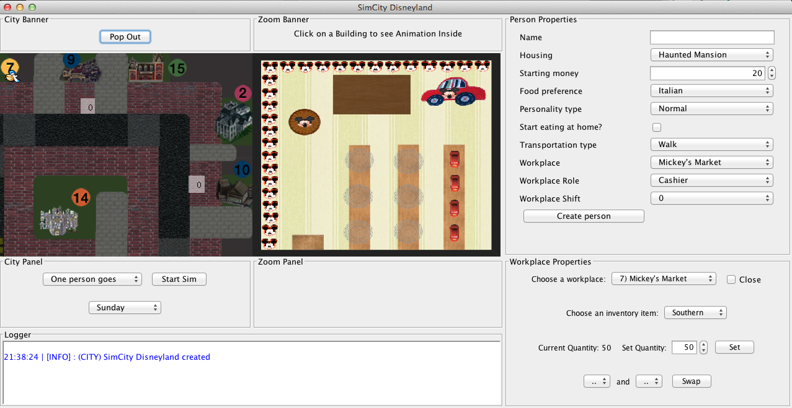
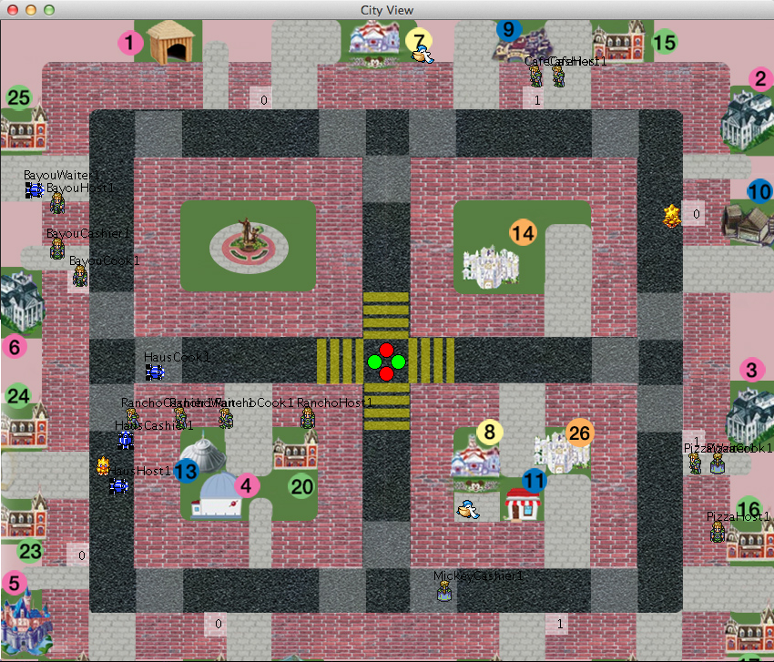

SimCity201 Team Project: Disneyland
===============================================

This may or may not be a CS201 assignment, depending on whether or not you are a cheater. It is licensed under the GNU GPLv3 license, which requires you to attribute me and my teammates in some manner so you get a zero and we don't get brought up in front of judicial affairs.

The GNU GPLv3 license is freely available online.

All sprites are the property of their respective owners.
Thanks to the [Spriter's Resource](http://www.spriters-resource.com/) for the sprite sheets.
Map images taken from [the map of Disneyland](http://disney.wikia.com/wiki/File:Disneyland_map_2011.jpg).

###Team Members
[Douglass Chen](https://github.com/Narwhalprime) 
[Dylan Eirinberg](https://github.com/dylane629) 
[Erika Johnson](https://github.com/erikajohnson) (that's me!) 
[Daron Lee](https://github.com/DaronLee) 
[Kelsey Rose](https://github.com/kelseyfrose)

###Map legend (useful for tracking locations)
+ **Houses:** (1) Tiki Hut (2) Haunted Mansion (3) Pirate's Suite (4) Space Mountain (5) Cinderella Castle (6) Rabbit Hole
+ **Markets:** (7) Mickey's Market (8) Minnie's Market
+ **Restaurants:** (9) Rancho Del Zocalo (10) Village Haus (11) Carnation Cafe (12) Blue Bayou (13) Pizza Port
+ **Banks:** (14) Pirate Bank (26) Buccaneer Bank
+ **Apartments:** (15) Main St Apts #1 (16) Main St Apts #6 (17) Main St Apts #7 (18) Main St Apts #11 (19) Main St Apts #10 (20) Main St Apts #4 (21) Main St Apts #9 (22) Main St Apts #8 (23) Main St Apts #5 (24) Main St Apts #3 (25) Main St Apts #2

###Screenshots

###Demo

###Instructions
+ IMPORTANT: Please use Eclipse to compile and run the project. It was brought to attention by one of the teaching assistants that using the Ant build file would cause problems since we files of the same name in different files.
+ To import into Eclipse: (1) clone the repository, (2) File > Import > Existing Projects into Workspace and then navigate to the location of the cloned repository and import it, (3) right-click the root folder and select Build Path > Configure Build Path > Add External JARs... and then navigate to the Java file (typically rt.jar) on your computer and add it, (4) import JUnit by hovering over errors in any of the unit test files.
+ Locate the SimCityGui.java file in the simcity.gui package, and execute it as a Java Application in Eclipse by right-clicking the file and selecting Run As > Java Application.

###How to use configuration file
Configuration file system uses a main configuration file and several properties files. Each properties-file contains information about one person except any housing-related properties, and the main configuration file is responsible for assigning people to their homes and who owns what housings.

###Scenarios
+ Important: The basic time unit of the city is a "tick", or 1/8 of a second. In this version the day length is specified to at least 1200 ticks. Thus, if the simulation ever seems frozen, wait until the day ends. By then the people should be sleeping in their houses. The current # of ticks passed in the day should be displayed in console.
+ Different scenarioes can be loaded from configuration files located in src/res. See the above section on more information.

###Contributions

+ **_Douglass (Person and Person Property Panel on the GUI):_**
	+ The entirety of the PersonAgent design - data, scheduler, messages, actions
	+ Since PersonAgent is the middleman of all the other buildings in the city, the PersonAgent is responsible for integrating all of the markets/restaurants/etc. together
	+ A Person tracks money on hand, hungry or not, whether he has jobs or not, preferred transportation method, etc.
	+ A Person has pointers to all other locations in the city and avoids shared data via wrapper classes (e.g. MyBank objects for each Bank)
	+ Our design philosophy is to make the PersonAgent class an abstraction that tracks individual data for each person in the city and holds the entire city system together. A Person does not "enter" a location (including Transportation) but rather spawns a copy of himself with the necessary data that serves to link the PersonAgent with any other class in the city. This serves to decouple our design and prevent sharing of data which would break our Agent methodology.
	+ Created central config file (for all people) and person properties files (for each individual person) that are read in at run time.
	+ Added Person Properties Panel on the GUI to add people to the simulation after the program has started.

	
+ **_Daron (Transportation and City Panel on GUI):_** 
	+ The locations in the City Panel (top-left panel) are all clickable on the locations to change the building window.
	+ Transportation spawns transportation agents when receiving messages from people to go somewhere.
	+ A* is implemented for each type of transportation agent so that each only moves on certain tiles and prevent (almost all) collisions.
	+ Roads are constrained to where cars may go. This simulates real lanes of traffic. U-turns are allowed in some places.
	+ The bus is our own personal Chocobus! (The yellow flightless bird on the roads)
	+ The bus uses a queue that is updated to determine its route. This route is set at the beginning and cannot be changed. Nor will the bus change course for another vehicle.
	+ If a person wants to get off at the same stop he gets on, he just walks to his destination.
	+ All people if prompted to go a far distance will bus. People who prefer walking will walk farther before taking the bus.
	+ The truck is a flying Pelipper (white bird with huge beak). As such, the truck may fly over any tile but still responds to collisions with other agents.
	+ The truck goes to an idle position next to the market.
	+ Everything is animated. People have an animation to show that they are entering a building. Cars sadly do not.
	+ Unit tests for the animation system and the transportation controller are located in src/transportation/Tests/
	+ Redesigned city view for new buildings
	+ Created dynamic camera panning feature for city view
	+ Intersection prevents agents from moving through according to stop light. Agents will not recalculate A* if they encounter a stop light.
	+ A* now only recalculates based on areas the agent knows are blocked and will stay blocked
	+ The crash scenario forces cars to drive recklessly and crash into everything any anything in their way. It also freezes the traffic light to gaurantee the rear ending of some cars. Not meant for a stand alone scenario. The normal crash chance is 1%.

	
+ **_Dylan (Bank and Workplace Property Panel on the GUI):_** 
	+ Created the bank which includes BankCustomerAgents (spawned PersonAgents), TellerAgents and one ManagerAgent
	+ Also designed gui/characters/sprites/images for bank
	+ Redesigned GUI to include new panels and miscellaneous gui bug fixes
	+ Created and linked Workplace Properties panel (lower right side)
	+ Set base for switching job functions
	+ **The bank should function properly with the following assumptions:**
		+ A person will only make one action (new account, withdraw or deposit) per trip to the bank
		+ A person will never say they deposited more money than they actually did
		+ Thieves only attempt to rob the bank once (when they enter the simulation). They can succeed or fail the robbery (fall and drop the money) but they will return as normal customers after. The success/fail decision is randomized but can be set to always true or false in the WPP GUI.
		+ A loan automatically is generated when a person withdraws more money in the account than they have. Each time they revisit the bank for the SAME account, their time to pay back the loan decreases. Customers can take out multiple loans, but their time to pay them back won't reset. If they fail to pay back the loan in the number of visits they won't be able to take out another loan. Additionally they're loan will grow by increasing interest. After the first day of missing a loan they will owe an additional 25 dollars, then an additional 50 for the second day and so on. There are steep fines for missing payment on loans.
	
	+ **Unit Tests:** I designed a complete BankCustomerTest and ManagerTest. TellerTest was too repetitive and didn't prove anything since BankCustomerTest passed all of its tests. See the intro of BankCustomerTest.java for more details.
	

+ **_Erika (Markets, Housing, and Logger and Pop-Out on the GUI):_** 
	+ Designed and implemented the Housing and Market components, incl. related agents, animations, graphics and tests; took over the Market component when a team member dropped out of the class a few days into the project.
	+ Housing serves as the "default" location for the Person, so it is unique in that it passes the control back to the Person each time it completes a task. Thus, the Person has control over the ResidentAgent's actions by sending messages to the Housing class. Housing provides a choice between a "house" which accomodates one Person, or an "apartment" which accomodates up to four Persons. There are 6 houses and 11 apartments and each one has a different graphical design. Within houses, specialized path-finding is used (via adding "walls" and algorithm that avoids "walls" during movement) so the residents do not run into objects. The apartment houses up to 4 residents, and each one has his own spot at the table and in the kitchen, so they don't sit on top of each other or cook on top of each other. In both the apartments and houses, residents can cook, eat, do maintenance (in apartments, residents go to their desk in their bedrooms; in houses, they go to the couch), and go to sleep. Residents in apartments have the same table, kitchen, entrance/exit, and refrigerator (i.e. food inventory).
	+ Markets can serve in-person customers, "virtual" (i.e. home delivery) customers, and restaurant delivery customers. When Markets receive an in-person order, the Worker brings the item(s) to the Cashier station to give to the Customer. When Markets receive "virtual"/delivery orders, the Worker brings the item(s) to the truck loading zone, and the Market's truck is sent to deliver the item(s). The market employs a manager, a cashier (represented on the GUI by a Mickey character), and workers (represented on the GUI by another Mickey character). The market can be open or closed, and when it is open it operates normally; when it is closed it rejects customers. There are two markets. Employees in the market (manager, cashier, and workers) change shifts and are paid at the end of their shift. Market customers wait in line in the GUI and move up accordingly when other customers finish and leave. Workers have a home position and go to one of the three shelves to retrieve items.
	+ Debugged the Bank component and fixed issues such as multiple bank customers being spawned. 
	+ Added to the Restaurant and Transportation components (CookAgent, CashierAgent, TransportationController, TruckAgent) for the Restaurant-Market and Transportation-Market interactions.
	+ Contributed to the main GUI city zoom panel creation.
	+ Created the "pop-out" screen that displays a full-sized view of the main city GUI that functions similarly to the normal screen. The normal screen updates when the pop-out screen is closed, and the pop-out screen automatically closes when a building is clicked (for immediate viewing of the zoom animation for the building you just clicked).
	+ Created logger panel in bottom of the GUI.
	+ Helped with Person Property Panel and scenario selection in the GUI.
	+ Implemented Producer-Consumer behavior in the Blue Bayou restaurant (aka restaurant_bayou).

+ **_Kelsey (Restaurants, Front-End Lead on the GUI):_** 
	+ Integrated all 5 restaurants using a base Restaurant interface that all restaurants implement from created many new methods inside said interface and implemented them in each restaurant so that other components can communicate easily with the restaurants and get the information that they need
	+ Updated the menus in the restaurants in order to have the same kind of data type for menu used in all restaurants, so that all menus are accessible in the same way when persons are not inside the restaurant
	+ Updated and upgraded animations in all restaurants
	+ debugged restaurants whenever possible while integrating
	+ Wrote framework to upgrade all restaurants to accept and release workers for shifts. The workers come into the restaurant and are spawned, and when the shift is over workers have to decide when they can leave based on their states and current data. This is especially complicated for error cases such as when not all workers are in the restaurant
	+ All restaurants have ability to accept and release workers for shifts. Rancho del Zocalo (RestaurantRancho) and Pizza Port (RestaurantPizza)'s implementations are the most heavily tested and therefore I am most comfortable with their success in implementing shifts. Implementing the code in the many different restaurants turned out to be a much bigger challenge (time wise) than our team originally thought, so I focused on testing my own restaurant (RestaurantRancho) especially.
	+ Upgraded restaurants to pay workers when their shifts are over. Workers divide the profit gained during their shift. Cashier keeps track of balance and profit.
	+ Upgraded restaurants to be open or closed and to return whether they are opened or closed based not only on updates from timer but also on whether the restaurant is fully staffed and ready for customers
	+ Designed and created all background images for restaurants
	+ Created SimCity Disneyland Map/Image and panel (Daron made the image clickable and therefore established the grid of the SimCity image)
	+ Established guidelines for all images and panels in SimCity so that the Front End is attractive and easily understood
	+ Designed layout and wrote main GUI code
	+ Updated my restaurant (restaurant_rancho, or Rancho Del Zocalo) to include Producer-Consumer model, Bank integration, and new Market integration. Also updated RestaurantPizza to support Market integration. Helped team members to integrate the Producer-Consumer model into their own restaurants based on my implementation.
	+ (Messages to bank work but messages from bank do not work, as members of our team decided to nix bank and restaurant integration in support of the profit dividing system I detail earlier)
	+ Miscellaneous fixes for all restaurants, including animation, agent code flaws, etc.
	+ UNIT TESTING: I unit tested the restaurant integration with market and bank with a cashier test, as the cashier is the main point of contact for the bank and interacts with the market. I removed test cases 5 and 6 in the cashier test from v2.2 and added 6 more unit tests to fully test the market and bank integration with restaurant.

